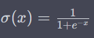

# Laporan Proyek 1 Machine Learning - Mokhamad Wijaya

## Domain Proyek

Pepatah mengatakan buku adalah jendela dunia. Buku menyajikan berbagai ragam pengetahuan yang dibutuhkan manusia untuk hidup dan berkembang ke arah yang maju. Bagi orang yang senang membaca buku, buku merupakan sebuah barang yang berharga. Dengan berkembangnya teknologi, pembaca buku tidak terbatas pada membaca buku secara fisik, namun juga dapat membaca buku digita, baik secara daring maupun luring. Buku digital atau disebut _e-book_ adalah buku yang berbentuk data elektronik yang dapat dimuat pada sistem operasi terntentu dan/atau perangkat tertentu. Penikmat buku tidak harus membeli buku dalam bentuk fisik untuk membaca buku kapanpun dan dimanapun.

Terdapat ribuan atau bahkan jutaan judul buku yang tersedia di pasar baik pasar elektronik atau _e-commerce_ maupun non elektronik seperti toko buku yang sudah ada. Dengan volume yang begitu besar, konsumen sering kali kesulitan menemukan buku yang relevan dan sesuai dengan minat mereka. Sedangkan tiap konsumen memiliki preferensi dan minatnya masing-masing. Oleh karena hal tersebut, dikembangkan sistem rekomendasi yang mampu memberikan saran judul buku pada konsumen buku di dalam _e-commerce_.

Dilihat dari sudut pandang penjual buku, khususnya _e-book_, sistem rekomendasi berpengaruh pada tingkat penjualan buku yang ditawarkan. Dengan meningkatnya penjualan _e-book_ dikarenakan kepuasan konsumen akibat sistem rekomendasi yang merekomendasikan buku yang sesuai dengan preferensi dan minat, maka penjual buku dapat memperoleh profit lebih banyak dan mengembangkan bisnisnya.

Berikut beberapa manfaat dari sistem rekomendasi buku.

1. Meningkatkan kepuasan pelanggan: Ketika konsumen menemukan buku yang mereka nikmati atau bermanfaat, mereka lebih puas dengan pembelian mereka. Hal ini dapat meningkatkan kepercayaan pelanggan dan menghasilkan lebih banyak peluang untuk mendapatkan ulasan positif atau referensi, yang berkontribusi pada pertumbuhan bisnis.

2. Pengenalan produk baru: Sistem rekomendasi dapat memperkenalkan buku-buku baru atau kurang populer kepada pelanggan yang mungkin belum mengetahuinya. Ini membantu para penulis dan penerbit untuk meningkatkan visibilitas karya mereka dan mencapai audiens yang lebih luas.

3. Dorongan penjualan lintas kategori: Ketika seorang pelanggan sedang mencari atau membeli buku dalam satu kategori, sistem rekomendasi dapat menyarankan buku-buku terkait atau sejenis dari kategori lain. Hal ini membuka peluang untuk meningkatkan penjualan lintas kategori dan mendorong eksplorasi lebih lanjut oleh konsumen.

4. Pengoptimalan stok: Dengan memanfaatkan data penjualan dan preferensi pelanggan, toko buku dapat mengoptimalkan stok mereka untuk memastikan bahwa buku-buku yang paling diminati tersedia dalam jumlah yang memadai. Ini membantu menghindari situasi kehabisan stok atau akumulasi buku yang kurang diminati.

5. Efisiensi promosi: Sistem rekomendasi juga memungkinkan toko buku atau platform e-commerce untuk mengarahkan promosi dengan lebih efisien. Daripada melakukan iklan secara acak, mereka dapat menyusun kampanye yang ditargetkan berdasarkan preferensi dan riwayat pembelian pelanggan.

Ketika jumlah buku yang disediakan perpustakaan relatif banyak, pengguna akan kesulitan untuk memilih buku yang sesuai dari sekian banyak calon buku. Dalam hal ini, makalah ini merancang sistem rekomendasi yang dipersonalisasi untuk perpustakaan perguruan tinggi berdasarkan algoritma rekomendasi hybrid. Pertama-tama, makalah ini mempelajari penerapan collaborative filtering dan algoritma rekomendasi berbasis konten dalam rekomendasi buku universitas, yang melibatkan klasifikasi pembaca, pembentukan matriks penilaian pengguna-item, konstruksi model ruang vektor dan perhitungan kesamaan antara pengguna. Dan dengan mempertimbangkan karakteristik buku dan pembaca di universitas, pengguna - matriks penilaian item ditingkatkan, dan pengelompokan digunakan untuk mengatasi masalah ketersebaran data. Lakukan eksperimen komparatif menggunakan algoritme hibrid dalam kumpulan data Library of Inner Mongolia University of Technology. Hasilnya menunjukkan bahwa metode hybrid dapat memberikan rekomendasi yang lebih akurat daripada pendekatan murni. Terakhir, platform data besar Spark yang dikombinasikan dengan algoritme rekomendasi hibrid digunakan untuk mencapai desain sistem rekomendasi buku yang dipersonalisasi.[1]

## Business Understanding

### Problem Statements

Berdasarkan kondisi yang telah diuraikan sebelumnya, penulis akan mengembangkan sebuah sistem rekomendasi _e-book_ untuk menjawab permasalahan berikut.

- Bagaimana cara membuat model sistem rekomendasi _e-book_ dengan neural network dari metode Collaborative Filtering?
- Bagiamana tingkat nilai error model yang akan dilatih? 

### Goals

Untuk  menjawab pertanyaan tersebut, penulis membuat sistem rekomendasi dengan tujuan atau goals sebagai berikut:

- Membuat model _machine learning_ dengan metode _neural network_ yang dapat memberikan daftar rekomendasi buku dengan seakurat mungkin.
- Mengetahui tingkat nilai error dari model yang akan dilatih.

## Data Understanding

Data yang digunakan dalam proyek ini adalah [**Book Recommendation Dataset**](https://www.kaggle.com/datasets/arashnic/book-recommendation-dataset). Dataset tersebut terdiri dari 3 file yaitu `Books.csv`, `Ratings.csv` dan `Users.csv`.

### Dataset Books

Dataset `Books.csv` terdiri dari 271360 data dengan 8 kolom yang berisikan 'ISBN', 'Book-Title', 'Book-Author', 'Year-Of-Publication', 'Publisher', 'Image-URL-S', 'Image-URL-M', 'Image-URL-L'. Berikut adalah penjelasan dari tiap fitur yang ada dataset tersebut.

- ISBN: nomor atau id unik buku.
- Book-Title: judul buku
- Book-Author: nama _author_ buku.
- Year-Of-Publication: Tahun publikasi
- Publisher: Penerbit buku
- Image-URL-S: alamat gambar sampul buku ukuran kecil
- Image-URL-M: alamat gambar sampul buku ukuran sedang
- Image-URL-L: alamat gambar sampul buku ukuran besar

Untuk memahami tipe data apa saja yang terdapat pada dataset dapat dilakukan dengan menggunakan fungsi pandas `Dataframe.info()`. Tipe data pada dataset `Books.csv` adalah sebagai berikut.

| idx | Column              |  Non-Null Count |  Dtype  |
| --- | ------              |  -------------- |  -----  |
| 0   | ISBN                | 271360 non-null |  object |
| 1   | Book-Title          | 271360 non-null |  object |
| 2   | Book-Author         | 271359 non-null |  object |
| 3   | Year-Of-Publication | 271360 non-null |  object |
| 4   | Publisher           | 271358 non-null |  object |
| 5   | Image-URL-S         | 271360 non-null |  object |
| 6   | Image-URL-M         | 271360 non-null |  object |
| 7   | Image-URL-L         | 271357 non-null |  object |

Tipe data pada semua kolom atau fitur adalah non numerik sehingga membutuhkan konversi ke tipe data numerik sebelum dilakukan pengembangan model.

Setelah mengetahui tipe data, kemudian dilakukan pengecekan duplikasi data dengan bantuan fungsi `Dataframe.duplicates()` untuk menghindari hasil daftar rekomendasi buku menjadi buruk. Setelah dilakukan pengecekan duplikasi pada dataset Books, tidak terdapat data duplikat.
> jumlah baris duplikasi dataset Books:  0

Setelah melakukan pengecekan duplikasi data pada dataset Books, dilakukan pengecekan _missing value_ pada fitur-fitur dataset Books. Setelah dilakukan pengecekan _missing value_ dengan menggunakan fungsi `Dataframe.isnull().sum()`

| Fitur/Kolom         | jumlah |
| ------------------- | ------ |
| ISBN                |   0    |
| Book-Title          |   0    |
| Book-Author         |   1    |
| Year-Of-Publication |   0    |
| Publisher           |   2    |
| Image-URL-S         |   0    |
| Image-URL-M         |   0    |
| Image-URL-L         |   3    |

Terlihat pada tabel hasil pengecekan _missing value_ pada dataset Books, terdapat data yang tidak lengkap pada fitur 'Book-Author', 'Publisher', dan 'Image-URL-L'.

### Dataset Ratings

Dataset `Ratings.csv` terdiri dari 1149780 data dengan 3 kolom yang berisikan 'User-ID', 'ISBN', dan 'Book-Rating'. Berikut adalah penjelasan dari tiap fitur yang ada dataset tersebut.

- User-ID: nomor unik pengguna/konsumen.
- ISBN: nomor atau id unik buku.
- Book-Rating: _rating_ buku dengan skala 0 sampai 10.

Untuk memahami tipe data apa saja yang terdapat pada dataset dapat dilakukan dengan menggunakan fungsi pandas `Dataframe.info()`. Tipe data pada dataset `Ratings.csv` adalah sebagai berikut.

| idx | Column              |  Non-Null Count  |  Dtype  |
| --- | ------              |  --------------  |  -----  |
| 0   | User-ID             | 1149780 non-null |  int64  |
| 1   | ISBN                | 1149780 non-null |  object |
| 2   | Book-Rating         | 1149780 non-null |  int64  |

Tipe data pada kolom User-ID dan Book-Rating adalah numerik. Tipe data pada ISBN adalah non numerik.

Setelah mengetahui tipe data, kemudian dilakukan pengecekan duplikasi data dengan bantuan fungsi `Dataframe.duplicates()` untuk menghindari hasil daftar rekomendasi buku menjadi buruk. Setelah dilakukan pengecekan duplikasi pada dataset Ratings, tidak terdapat data duplikat.
> jumlah baris duplikasi dataset Ratings:  0

Setelah melakukan pengecekan duplikasi data pada dataset Ratings, dilakukan pengecekan _missing value_ pada fitur-fitur dataset Ratings. Setelah dilakukan pengecekan _missing value_ dengan menggunakan fungsi `Dataframe.isnull().sum()`

| Fitur/Kolom         | jumlah |
| ------------------- | ------ |
| User-ID             |   0    |
| ISBN                |   0    |
| Book-Rating         |   0    |

Terlihat pada tabel hasil pengecekan _missing value_ pada dataset Ratings, tidak ada _missing value_.

### Dataset Users

Dataset `Users.csv` terdiri dari 1149780 data dengan 3 kolom yang berisikan 'User-ID', 'Location', dan 'Age'. Berikut adalah penjelasan dari tiap fitur yang ada dataset tersebut.

- User-ID: nomor unik pengguna/konsumen.
- Location: alamat dari pengguna/konsumen.
- Age: usia pengguna dalam satuan tahun.

Untuk memahami tipe data apa saja yang terdapat pada dataset dapat dilakukan dengan menggunakan fungsi pandas `Dataframe.info()`. Tipe data pada dataset `Users.csv` adalah sebagai berikut.

| idx | Column              |  Non-Null Count  |  Dtype   |
| --- | ------              |  --------------  |  -----   |
| 0   | User-ID             | 278858 non-null  |  int64   |
| 1   | Location            | 278858 non-null  |  object  |
| 2   | Age                 | 168096 non-null  |  float64 |

Tipe data pada kolom User-ID dan Age adalah numerik. Tipe data pada Location adalah non numerik.

Setelah mengetahui tipe data, kemudian dilakukan pengecekan duplikasi data dengan bantuan fungsi `Dataframe.duplicates()` untuk menghindari hasil daftar rekomendasi buku menjadi buruk. Setelah dilakukan pengecekan duplikasi pada dataset Users, tidak terdapat data duplikat.
> jumlah baris duplikasi dataset Users:  0

Setelah melakukan pengecekan duplikasi data pada dataset Users, dilakukan pengecekan _missing value_ pada fitur-fitur dataset Users. Setelah dilakukan pengecekan _missing value_ dengan menggunakan fungsi `Dataframe.isnull().sum()`

| Fitur/Kolom         | jumlah |
| ------------------- | ------ |
| User-ID             | 0      |
| Location            | 0      |
| Age                 | 110762 |

Terlihat pada tabel hasil pengecekan _missing value_ pada dataset Users, terdapat _missing value_ yang terbilang cukup banyak pada kolom/fitur Age.

## Data Preparation

Berikut persiapan data yang dilakukan yaitu:

1. Penggabungan dataset

    Untuk membuat model sistem rekomendasi, dataset yang dibutuhkan harus sudah tertata sebelum dilakukan proses pelatihan model. Dataset Books digabungkan dengan dataset Ratings berdasarkan fitur ISBN. Kemudian Dataset tersebut digabungkan dengan Dataset Users sehingga menjadi dataset yang utuh.

    | idx | Column              |  Non-Null Count |  Dtype   |
    | --- | ------              |  -------------- |  -----   |
    | 0   | ISBN                | 241066 non-null |  object  |
    | 1   | Book-Title          | 241066 non-null |  object  |
    | 2   | Book-Author         | 241066 non-null |  object  |
    | 3   | Year-Of-Publication | 241066 non-null |  int64   |
    | 4   | Publisher           | 241066 non-null |  object  |
    | 5   | Image-URL-S         | 241066 non-null |  object  |
    | 6   | Image-URL-M         | 241066 non-null |  object  |
    | 7   | Image-URL-L         | 241066 non-null |  object  |    
    | 8   | User-ID             | 241066 non-null |  int64   |    
    | 9   | Book-Rating         | 241066 non-null |  int64   |    
    | 10  | Age                 | 241066 non-null |  float64 |    

2. Encoding Fitur Non Numerik dan numerik

    Terdapat tipe data non numerik pada fitur ISBN, Book-Title, Book-Author, dan Publisher (Image-URL-S, Image-URL-S, dan Image-URL-S dikecualikan karena fitur ini tidak digunakan sebab model tidak akan menerima 3 variabel tersebut). Dikarenakan model hanya akan memproses data dengan fitur ISBN dan User-ID sebagai inputan dan Book-Rating dalam skala 0-1 sebagai output, maka hanya fitur ISBN dan User-ID yang di-_encode_.

3. Standarization

    Untuk menyesuaikan output model yang akan berskala 0 - 1, maka nilai fitur rating diubah dengan cara nilai fitur dibagi nilai terendah kemudian dibagi dari hasil pengurangan antara nilai fitur maksimal terhadap nilai fitur minimal. Pada proyek ini, nilai minimal fitur rating adalah 0 dan nilai maksimal rating adalah 10. Perhitungannya adalah sebagai berikut.

    misal nilai fitur rating _x_ = 2
    kemudian 

4. Train-Test-Split

    Setelah semua fitur berupa numerik, kemudian lakukan *train-test-split*. *train-test-split* adalah metode yang digunakan dalam pembelajaran mesin dan statistik untuk membagi data menjadi dua subset yang saling terpisah, yaitu data pelatihan (training data) dan data pengujian (testing data).

    Selanjutnya pilih fitur target atau fitur yang akan dijadikan prediksi yaitu fitur `rating` dalam skala 0-1 lalu tandai sebagai variabel "**y**". Fitur-fitur yang akan diinputkan ke dalam model terbatas pada User-ID dan ISBN, ditandai dengan variabel "**X**".
    
    Rasio pembagian data latih dan data uji yaitu 90:10 karena dataset memiliki sedikit data. Total data setelah penggabungan dataset dan sampling sebesar 5000. Setelah dibagi dengan rasio 90:10, maka total data latih sebesar 4500 dan data uji sebesar 500.

## Modeling

Model yang akan dibuat untuk sistem rekomendasi adalah model dengan _neural network_ dari metode Collaborative Filtering. _Neural Network_ (Jaringan Saraf Tiruan) adalah model komputasi yang terinspirasi oleh struktur dan cara kerja jaringan saraf biologis pada otak manusia. Model ini merupakan bagian dari cabang ilmu _machine learning_, khususnya dalam bidang _deep learning_.

_neural network_ terdiri dari satu atau lebih lapisan (layer) dari "neuron" atau "unit" kecil, yang juga disebut "node." Setiap neuron menerima input dari neuron-neuron pada lapisan sebelumnya, mengalikannya dengan bobot tertentu, dan menjumlahkan hasilnya. Kemudian, input yang dihasilkan akan diproses melalui fungsi aktivasi sebelum diteruskan ke neuron-neuron pada lapisan selanjutnya.

Beberapa konsep penting dalam Neural Network adalah:

Input Layer: Lapisan pertama dari jaringan, menerima input dari data yang diberikan.

Hidden Layer: Lapisan-lapisan antara input dan output layer. Mereka berisi neuron-neuron tersembunyi yang melakukan proses pemrosesan dan representasi fitur dari input.

Output Layer: Lapisan terakhir dari jaringan yang menghasilkan output prediksi atau hasil dari proses komputasi.

Bobot (Weights): Setiap sambungan antara neuron memiliki bobot tertentu yang menentukan seberapa kuat atau lemahnya pengaruh input terhadap neuron berikutnya.

Fungsi Aktivasi: Fungsi yang diterapkan pada output dari setiap neuron untuk mengintroduksi non-linearitas dalam model dan membantu jaringan untuk mempelajari hubungan yang kompleks dalam data.

Forward Propagation: Proses mengalirkan input data dari input layer hingga output layer untuk menghasilkan prediksi.

Backpropagation: Algoritme untuk menghitung gradien kesalahan (loss) jaringan terhadap bobotnya, sehingga model dapat mengoreksi bobotnya selama proses pelatihan dan meningkatkan performa.

Neural Network telah mengungguli banyak bidang dalam ilmu data, seperti pengenalan wajah, pemrosesan bahasa alami, pengenalan suara, permainan komputer, dan banyak lagi. Model Deep Learning yang lebih kompleks seperti Convolutional Neural Networks (CNNs) dan Recurrent Neural Networks (RNNs) telah memberikan terobosan besar dalam beberapa masalah pemrosesan data yang sulit dan kompleks.

Model yang dipakai pada proyek ini terinspirasi dari [**RecommenderNet**](https://www.kaggle.com/datasets/arashnic/book-recommendation-dataset). Berikut adalah arsitektur dari model tersebut.

Arsitektur model tersebut terdiri dari 4 layer embedding. 

1. Layer pertama adalah layer user embedding menggunakan class `tensorflow.keras.layers.Embedding` dengan parameter dimensi input sebesar jumlah user yaitu 2207, dimensi output sebesar 50, `embedding_initializer` berupa 'he_normal' dan `embeddings_regularizer` menggunakan `tensorflow.keras.regularizers.l2` dengan paramternya 1e-6.

2. Layer kedua adalah layer user bias menggunakan class `tensorflow.keras.layers.Embedding` dengan parameter dimensi input sebesar jumlah user yaitu 2207, dan dimensi output sebesar 50.

3. Layer ketiga adalah layer book (isbn) embedding menggunakan class `tensorflow.keras.layers.Embedding` dengan parameter dimensi input sebesar jumlah user yaitu 5000, dimensi output sebesar 50, `embedding_initializer` berupa 'he_normal' dan `embeddings_regularizer` menggunakan `tensorflow.keras.regularizers.l2` dengan paramternya 1e-6.

4. Layer keempat adalah layer book (isbn) bias menggunakan class `tensorflow.keras.layers.Embedding` dengan parameter dimensi input sebesar jumlah user yaitu 5000, dan dimensi output sebesar 50.

Proses dari keempat layer tersebut dimulai dari menginisialisasi layer-layer tersebut sesuai dengan inputan (user dan isbn/buku), kemudian layer pertama dan ketiga dimasukkan ke dalam fungsi `tenforflow.tensordot`. Tensordot (juga dikenal sebagai kontraksi tensor) menjumlahkan produk elemen dari a (user embedding) dan b (isbn embedding) pada indeks yang ditentukan oleh _axes_ (2) yang dalam hal ini, hasil luarannya dinamakan _dot product_ antara user dan isbn.

Kemudian dilakukan penjumlahan _dot product_ antara user dan isbn dengan bias user dari layer kedua dan bias isbn dari layer keempat. Hasil dari perhitungan tersebut kemudian dimasukkan ke dalam fungsi `tensorflow.nn.sigmoid`. Sigmoid adalah salah satu fungsi aktivasi yang sering digunakan dalam lapisan neuron pada _neural network_. Fungsi sigmoid memiliki bentuk S yang dapat mengambil input berupa bilangan riil dan menghasilkan output yang berada dalam rentang 0 hingga 1.

Secara matematis, fungsi sigmoid (σ) didefinisikan sebagai berikut:

di mana:

x adalah input ke neuron (jumlahan dari hasil perkalian bobot dan input dari neuron-neuron di lapisan sebelumnya).

e adalah bilangan Euler (2.71828...), dasar logaritma alami.

Data input pada model adalah User-ID dan ISBN (untuk inferensi model berarti ISBN dari buku yang belum diberi rating oleh pengguna), kemudian diproses oleh model dari layer 1 sampai 4, sehingga menghasilkan daftar rekomendasi buku untuk User-ID tersebut.

kemudian dilakukan inferensi dari model untuk pengguna dengan User-ID = 2977 dengan hasil sebagai berikut.

Tabel Buku dengan rating yang tinggi dari pengguna

| ISBN       | Judul Buku                    | Author              |
| ---------- | ----------------------------- | ------------------- |
| 0553207628 | History of Women In America   | Carol Hymowitz      |
| 0140441077 | The Prince (Penguin Classics) | Niccolo Machiavelli |
| 0933932669 | The Sadness of Christ         | Thomas More         |
| 1573225681 | Living Buddha, Living Christ  | Thich Nhat Hanh     |

Tabel Top 10 Rekomendasi Buku untuk pengguna

| ISBN       | Judul Buku                    | Author              |
| ---------- | ----------------------------- | ------------------- |
3404128753   | Der Schatten des Herrn.       | John F. Case |
031298670X   | Elliott Roosevelt's Murder at the President's Door : An Eleanor Roosevelt Mystery (An Eleanor Roosevelt Mystery) | Elliott Roosevelt |
0425174336   | Crimson Stain | Jim Fisher |
0736905588   | The Proposal: Book 1 (The English Garden Series) | Lori Wick |
0201518015   | Husband Is the Past Tense of Daddy: And Other Dispatches from the Front Lines of Motherhood | Teryl Zarnow |
0310904102   | Comparative Study Bible | Not Applicable (Na ) |
1854060627   | Baby Apatosaurus | Dick Dudley |
0679808477   | The Berenstain Bears and the Prize Pumpkin (First Time Books) | STAN BERENSTAIN |
0140439161   | The Bounty Mutiny (Penguin Classics) | William Bligh |
0553379925   | Caring for Your School Age Child : Ages 5-12 | EDWARD L. SCHOR |

## Evaluation

Untuk mengevaluasi model yang telah dilatih, proyek ini menggunakan metrik `error`. Metrik eror adalah ukuran yang digunakan untuk mengevaluasi sejauh mana model machine learning melakukan kesalahan prediksi pada data yang telah diberikan.

### Metrik Error

Metrik eror adalah salah satu metrik evaluasi yang digunakan dalam model machine learning untuk mengukur seberapa besar nilai error model dalam melakukan prediksi. Nilai eror yang dimaksud adalah selisih antara nilai sebenarnya dan nilai prediksi.

Root Mean Squared Error (RMSE) adalah salah satu metrik evaluasi yang umum digunakan untuk mengukur kualitas atau akurasi prediksi model, termasuk pada Neural Network. RMSE mengukur seberapa besar selisih antara nilai prediksi yang dihasilkan oleh model dengan nilai sebenarnya dalam dataset.

Secara matematis, RMSE dihitung dengan langkah-langkah berikut:

1. Terlebih dahulu, lakukan prediksi menggunakan model Neural Network terhadap data uji atau data validasi. Setiap data uji menghasilkan nilai prediksi y_pred.

2. Bandingkan nilai prediksi (y_pred) dengan nilai sebenarnya (y_true) dari data uji dan hitung selisih antara keduanya.

3. Kuadratkan setiap selisih.

4. Hitung rata-rata dari semua kuadrat selisih.

5. Ambil akar kuadrat dari rata-rata tersebut untuk mendapatkan RMSE.

Secara matematis, rumus RMSE adalah sebagai berikut:

Berikut rumus matematika untuk menghitung nilai error RMSE:

Gambar 3. Rumus Root Mean Squared Error

di mana:

N = jumlah dataset

Actual_i = nilai sebenarnya

Predicted_i = nilai prediksi

RMSE mengukur akar rata-rata dari selisih antara prediksi dan nilai sebenarnya. Semakin kecil nilai RMSE, semakin baik performa model, karena artinya prediksi model lebih mendekati nilai sebenarnya. Sebaliknya, semakin besar nilai RMSE, semakin besar kesalahan prediksi model.

Dalam proses pelatihan Neural Network, tujuan utama adalah untuk meminimalkan nilai RMSE dengan mengoptimasi bobot dan bias pada jaringan agar prediksi model semakin mendekati nilai sebenarnya pada dataset pelatihan dan validasi.

Hasil dari evaluasi model menggunakan metrik error sebagai berikut:

Gambar 4. Garfik nilai error data latih dan data uji

Berdasarkan gambar di atas, dapat diambil kesimpulan bahwa model _neural network_ dengan arsitektur RecommenderNet mampu memberikan hasil yang terbilang cukup akurat dan cukup mengalami overfitting. Untuk mendapatkan nilai error yang lebih sedikit dan 

## Kesimpulan

Peminat buku membutuhkan sistem rekomendasi buku supaya dapat memilih buku sesuai dengan preferensi dan minat. Dengan hal tersebut, khususnya di dalam _e-commerce_, akan menimbulkan kepuasan konsumen dan berakibat meningkatnya penjualan buku. Oleh karena itu dibuatlah model *machine learning* untuk memberikan daftar rekomendasi buku dengan menggunakan dataset [**Book Recommendation Dataset**](https://www.kaggle.com/datasets/arashnic/book-recommendation-dataset) yang tediri dari 3 file `Books.csv`, `Ratings.csv` dan `Users.csv`. Kemudian dilanjut dengan proses _data preparation_ supaya model dapat memproses dataset yang selanjutnya akan dilakukan pelatihan model _neural network_ dengan menggunakan arsitektur [**RecommenderNet**](https://www.kaggle.com/datasets/arashnic/book-recommendation-dataset).
Setelah proses pelatihan model, model yang dievaluasi menggunakan metrik _error_ _root mean squared error_ (RMSE) dengan nilai 0.361360102891922 (pembulatan menjadi 0.3614).

Agar model dapat memberikan prediksi dengan nilai eror yang lebih rendah, maka penulis menyarankan untuk menggunakan jumlah data yang lebih banyak pada dataset supaya mengurangi kemungkinan terjadinya _overfitting_ dan melakukan hyperparameter tunning pada model yang telah penulis ajukan. Selain hal tersebut, bisa juga dilakukan menambah uji model lain untuk dibandingkan supaya dapat menemukan model yang paling kecil menghasilkan nilai eror.

## Referensi

[1]     Tian, Y., Zheng, B., Wang, Y., Zhang, Y., & Wu, Q. (2019). College Library Personalized Recommendation System Based on Hybrid Recommendation Algorithm. Procedia CIRP, 83, 490–494. [Available](https://doi.org/10.1016/J.PROCIR.2019.04.126)
